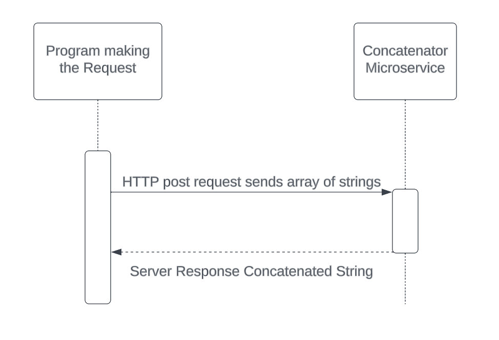

# string-microservice

npm install express body-parser

The client will send an HTTP request with an array of strings in its JSON body to be concatenated by the server. 
Like so:

{
	"strings": ["abcde", "fghij", "klmnop", "qrstuv", "wxyz"]
}

The server will then concatenate the strings and send them back in a response. 
A response to the given JSON example would look like this:

{
	"new_string": "abcdefghijklmnopqrstuvwxyz"
}

An example of a request is fiven in example-request.js

##UML Diagram

